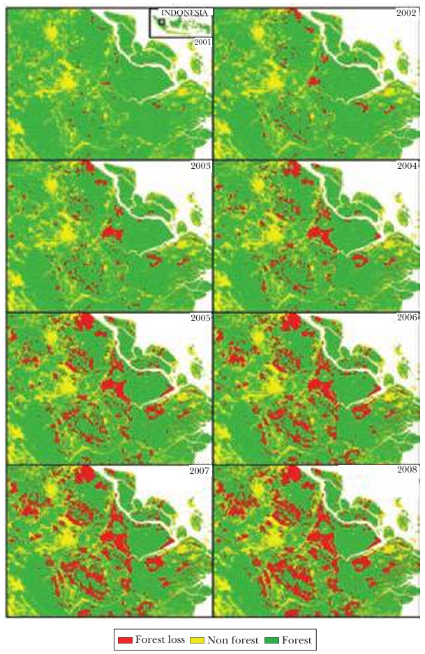
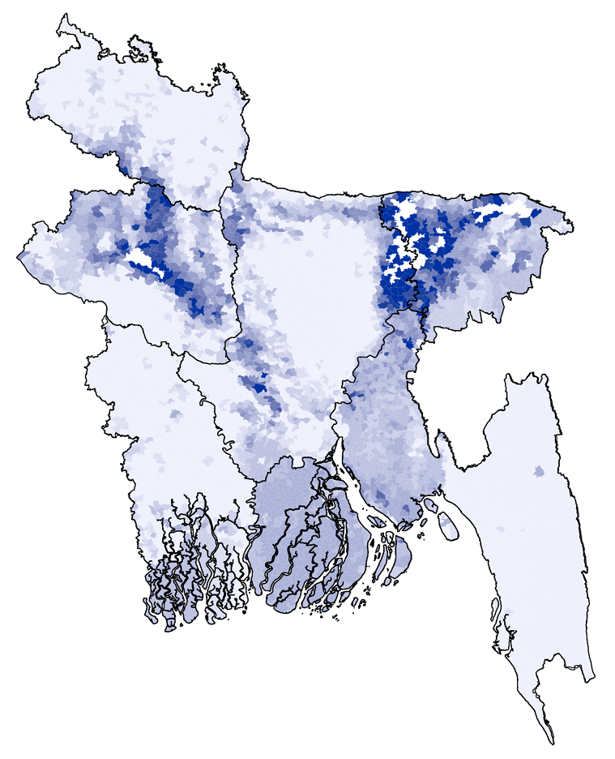
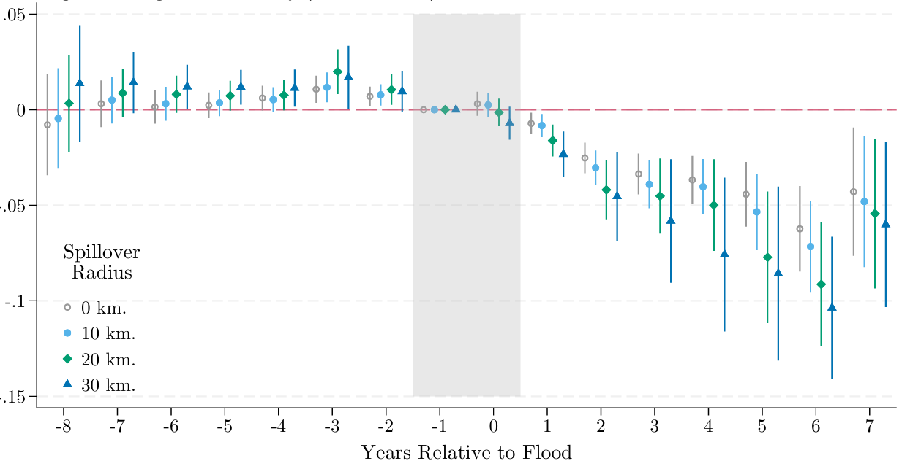
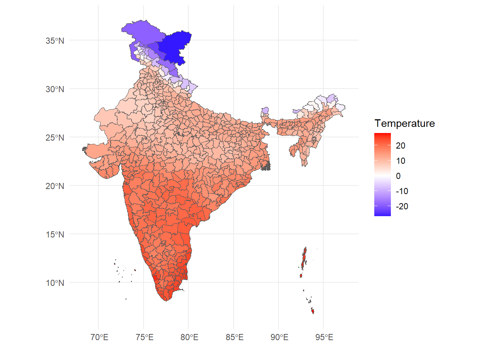

# Geospatial Data in R

## 1. Satellite data in economics

### 1.1 A simple economic question

Suppose we want to answer the following question:

> Do heat shocks reduce economic productivity?

Suppose we have firm-level data on output, capital expenditure, wages, and other economic outcomes. Is it feasible to measure temperature?

Not without significant costs. Why?

This requires linking a **physical surface** (temperature measured in geographic space) to **economic units** (districts, firms, households).

Economic data are organized by economic/administrative units.\
Climate and environmental data are organized by geography.

Spatial data provides the bridge between the two. We can answer this question with two sets of data: firm/plant locations and *spatial temperature data*.

### 1.2 Why spatial data?

I've motivated one example of why spatial data can be useful to economists. Here are two more.

#### Deforestation and political economy

Burgess et al. (2012) ask:

> How does administrative delimitation affect deforestation in Indonesia?

Forestry in Indonesia is heavily regulated. However, local officials may be bribed to overlook illegal logging. This creates a serious measurement problem: administrative forestry statistics, often produced in collaboration with local officials, may be systematically misreported.

::: {.columns}

::: {.column width="40%"}
Burgess et al. (2012) overcome this problem using satellite imagery to measure deforestation. They combine:

-   Spatial data on forest cover to track actual loss over time
-   Indonesian subnational administrative boundaries

They find:

-   Each additional district created within a province increases the province’s deforestation rate by 8.2 percent - local prices fall in the province by 3.3 percent.

-   Essentially, districts engage in Cournot-style competition in determining how much wood to extract from their forests.
:::

::: {.column width="60%"}
{.lightbox fig-align="right" width=300}
:::

:::

Without satellite-based spatial data, the study would have been constrained to potentially biased administrative statistics.

#### Floods and economic outcomes

Patel (2025) asks:

> What are the economic consequences of floods?

Flooding in Bangladesh is frequent, highly localized, and often poorly measured. Existing flood databases—such as those based on news reports or government records—systematically miss smaller or short-term floods, especially in poorer or more remote areas.

This creates a fundamental measurement problem: if floods are undercounted or mismeasured, we cannot credibly estimate their economic impact.

::: {.columns}

::: {.column width="40%"}
Patel combines:

- Radar-based satellite measurements of surface water, which allow daily detection of inundation

- Administrative boundary data for Bangladesh’s 5,158 unions (small local government units) to assign flood exposure precisely in space

- Satellite-based nighttime lights as a proxy for economic output
:::

::: {.column width="60%"}
{.lightbox fig-align="right" width=280}
:::

:::

He finds:

- Floods cause large, negative, and persistent (up to 7 years) declines in economic activity.

- Significant heterogeneity based on previous flooding history - past inundation exposure mitigates damages

{.lightbox fig-align="center" width=500}

### 1.3 What we will do today

Returning to the original question:

> Does heat reduce economic productivity?

We will work through one step of answering this question by creating and plotting a *spatial dataset* of temperature at the *district* level.

This is what it will look like.

{.lightbox}

## 2. The basics

### 2.1 A quick intro to R

R is a free and open-source programming language used mainly for stats and complex data visualization. Think of R as a *fancy calculator with lots of memory*: that is all we need it for.

Try this out:

```{r}
4 + 4
```

R is *vectorised* - it thinks of everything in terms of **vectors**. Let's create one:

```{r}
temp <- c(28,30,32,34)
```

Now, I can use the `temp` variable to perform statistical operations on the vector.

```{r}
mean(temp)
```

Binding several vectors together, we can create a **dataframe**. This is R's approximation of a table.

```{r}
#| warning: false
df <- data.frame(
  lon = c(77, 78),
  lat = c(28, 27),
  temp = c(300, 312)
)
```

```{r}
head(df)
```

Here's where R being *vectorised* is helpful - we can run operations on entire columns at once. We use the `$` operator to pinpoint a column from a dataframe.

Consider the following - right now, `temp` is in Kelvin. Let's convert it to degrees Celsius.

```{r}
df$tempC <- df$temp - 273.15
head(df)
```

90% of data work is just creating new columns.

### 2.2 Spatial data

We will use the library `terra` for spatial data manipulation.

```{r}
#| warning: false 

library(terra)
```

Up until Section 2.1, `df` is just a regular dataframe.

It has longitude and latitude columns, but R does not yet "know" that these numbers represent geographic coordinates.

To turn this into spatial data, we must tell R:

-   Which columns represent coordinates
-   What coordinate reference system (CRS) they use

::: {.callout-note title="What's a Coordinate Reference System (CRS)?"}
The Earth is a three-dimensional globe, but our maps are flat.\
To display locations on a screen, we must mathematically project the curved surface of the Earth onto a two-dimensional plane.

Whenever we work with spatial data, we are making a mathematical choice about how to represent the curved surface of the Earth on a flat plane. That choice is called a *projection*, and the full set of rules that define how coordinates map to the Earth is called a *Coordinate Reference System (CRS)*.

*Important!* Different spatial layers must share the same CRS in order to align correctly.
:::

```{r}
df_vect <- vect(
  df,
  geom = c("lon", "lat"),
  crs = "EPSG:4326"
)

df_vect
```

This is no longer a dataframe — it is a **SpatVector**. Spatial data = geometry + attributes.

Let’s plot these points.

```{r}
plot(df_vect)
```

At this point, we have created spatial data manually.

Consider however: the core dataframe has not changed. The difference is that `terra` now knows these rows live somewhere in space.

Later, when we overlay ERA5 grids with district boundaries, this geometric awareness will allow us to compute zonal statistics.

## 3. The task at hand: plotting ERA5 data

### 3.1 Overview

Before we touch ERA5, we need to understand two fundamental types of spatial data.

#### Vector data

Vector data represents *discrete objects*: lines (roads, rivers) or polygons (districts, states, countries)

Each feature has: a) A geometry (its shape) b) Attributes (data attached to it)

The vector data we will work are district boundaries (polygons) of India.

#### Raster data

Raster data represents *nearly-continuous surfaces*: temperature, precipitation, pollution concentration. Photographs are one kind of raster data.

A raster is *a grid of equally sized pixels with each pixel having some value*.

ERA5 temperature is raster data.

#### Our process

Consider a scenario: you want to find the effect of temperature on some economic outcome (prices, output, delinquency rates).

To compute district-level climate data:

-   Satellite-derived temperature data is **by grid cell**
-   But our econometric data is at the **district level**
-   We must aggregate raster values inside district polygons

This process is called **zonal statistics**.

### 3.2 Temperature data

::: callout-tip
## Where can we get temperature data?

Temperature data is available from several sources. In India, the **India Meteorological Department (IMD)** provides station-based observations. Internationally, agencies like **NASA**, **NOAA**, and the **European Centre for Medium-Range Weather Forecasts (ECMWF)** provide gridded climate datasets.

In this workshop, we use **ERA5**, produced by ECMWF under the Copernicus Climate Change Service. ERA5 is a global reanalysis dataset that combines weather models with billions of historical observations to produce consistent, high-resolution gridded data over time. It is widely used in economics because it offers: (i) global coverage, (ii) long time series, (iii) daily or hourly frequency, and (iv) internally consistent measurement across space and time — making it ideal for panel and spatial analysis.
:::

For temperature data, we will use the file emailed to you earlier.

Be sure to set the path in the below code to where you saved the file.

```{r}
r <- rast("era5_20250101_0000.nc")
r
```

Notice what R tells us:

-   Number of rows and columns → grid dimensions

-   Extent → geographic coverage

-   Resolution → size of each grid cell

-   CRS → coordinate reference system

Let's look at the raw raster data.

```{r}
plot(r)
```

ERA5 provides temperature in K. Therefore, similar to our exercise in Section 2.1, we convert K to degrees Celsius.

```{r}
r <- r - 273.15
plot(r)
```

This is called **raster algebra**. The subtraction is applied to every grid cell.

### 3.3 Boundary data

Now we load India district boundaries. This is vector data: polygons (the district shapes) with attributes (district names, state they belong to, any other data you wish to append).

```{r}
ind <- vect("India-Districts-2011Census.shp")
plot(ind)
```

*Reminder*: when working with two spatial datasets, they must share the **same CRS** to align correctly.

Which one should we transform?

In general:

-   **Vector data can be reprojected losslessly**

-   **Raster data should not be repeatedly reprojected**, because reprojection requires interpolation and can alter pixel values

```{r}
ind <- terra::project(ind, crs(r))
```

Now, let’s overlay them.

```{r}
plot(r)
plot(ind, add = TRUE)
```

We now have:

-   A temperature raster
-   Administrative boundaries

These are in the same coordinate system, so they align.

### 3.4 Zonal stats

Quick refresher of our goal:

For each district polygon, compute the mean temperature of all grid cells inside it. This operation is called **zonal statistics**.

```{r}
district_means <- extract(
  r,
  ind,
  fun = mean,
  na.rm = TRUE
)

head(district_means)
```

What happened here?

-   `extract()` identifies all raster cells within each polygon
-   `fun = mean` computes the average
-   The output is a table of district-level averages

Now we attach this back to the district polygons.

```{r}
ind$mean_temp <- district_means[,2]
```

### 3.5 Plotting

To plot spatial data, we use the following libraries.

```{r}
#| warning: false
library(ggplot2)
library(tidyterra)
```

Let us now plot the aggregated result.

```{r}
ggplot() +
  geom_spatvector(data = ind, aes(fill = mean_temp)) +
  scale_fill_gradient2(
    low = "blue",
    mid = "white",
    high = "red",
    name = "Temperature"
  ) + 
  theme_minimal()
```

At this stage, we can already begin asking substantive questions:

-   Which districts are the hottest?
-   Are hotter districts concentrated in particular states?
-   Is there a north–south gradient?
-   Is coastal India cooler than inland regions?

## 4. What Comes Next?

Today we used a single ERA5 file — one hour of temperature, one country.

But ERA5 is much richer than that:

-   Hourly data
-   Global coverage
-   Many climate variables (rainfall, wind, soil moisture, radiation)

In real research, we rarely use raw hourly data. Instead, we typically:

1.  **Time-average**
    -   Daily means\
    -   Monthly means\
    -   Seasonal averages\
    -   Growing season averages
2.  **Construct derived variables**
    -   Heatwave days (temperature \> threshold)\
    -   Degree days\
    -   Rainfall shocks\
    -   Drought indices
3.  **Build panel datasets**
    -   District × month panels\
    -   District × year panels\
    -   Merge with census or NSSO data
4.  **Use population-weighted aggregation**
    -   Weight grid cells by population instead of simple averages

The core logic, however, remains the same.

The important takeaway is that we now understand how to convert gridded climate data into administrative units that can be used in economic analysis.

Once you understand this transformation, you can work with almost any geospatial climate dataset.
